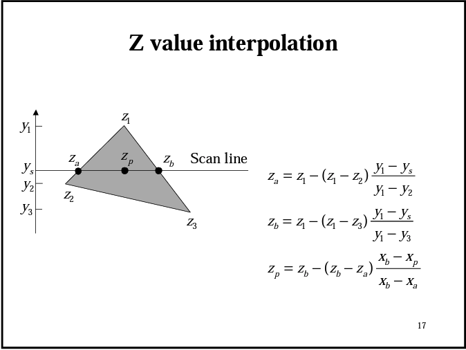

# Neocis_Assessment

This project present the implementation of a simple Polyhedron Visualizer using PyGame.

## Usage

Required Python libraries:
```shell
pygame
argparse
numpy
math
```
All three programs require one argument as the input filename that include metadata that contain polygon information, for example:
```shell
python3 Part1.py object.txt
```

## Part 1: Polyhedron Visualizer

In the first section, we implement a basic visualizer that demonstrate the polyhedron's edge and vertices. The user is able to either drag the polyhedron using a mouse to rotate it, or do minor rotation adjustment using the 'q','w','e','a','s','d' keys. The black dot represent the origin of the coordinate system.


The program first apply rotation matrix to the vertices accroding to the user input, then apply projection matrix for the purpose of 2D viewing. 


## Part 2: Polyhedron Visualizer with Shading

Next, we apply shading to the surface of the polyhedron. We have modified the shading color to alternate between (0,0,255) to (0,0,37) for a more vibrant shading. The edges and vertices visualization could be remove by commenting out the `visualizeEdges()` fucntion on line 207.


First, we figure out the order of shading the surface by ranking the z-value of the centroids of each polygon. The larger the z-value, the later its surface will be shaded since it overlaps the already shaded area. 

After that we acquire the shading color by calculating the normal vector of each polygon surface. We apply cross product of two edge vectos of the surface, then apply dot product with the normal vector of the x-y plane. We could successfully derive the angle between the normal vectors, and therefore the shading color. The blue color from (0,0,255) to (0,0,37) correspond to (0, pi/2).

## Part 3(bonus): Hidden Surface with Z-Buffer

In the final section, I've attempted a more standard method for solving the Hidden Surface problem in Computer Graphics using Z-Buffer. The algorithm essentially iterate through each polygon surface and mark the z-value(depth) of each pixel on the surface to a buffer. A pesudo-code is shown below.


At the same time, we could apply a trick to accelerate writing to the buffer called z-value interpolation. The trick apply a scan line for each y-value of the surface and interpolate the z values across. 



After implementing and debuging the program, I found that the method is too slow for pygame rendering, since we iterate all polygons pixels. As a result, the visualization stuck upon any user actions. The following is a demonstration of the initial partial rendering:


## Resources
https://cglearn.codelight.eu/pub/computer-graphics/shading-and-lighting
https://courses.cs.washington.edu/courses/cse557/00wi/lectures/hidden-surface.pdf
http://courses.washington.edu/arch481/1.Tapestry%20Reader/4.Rendering/2.Hidden%20Lines/1.Culling.html
https://www.cs.ubc.ca/~tmm/courses/cpsc414-03-fall/Vsep2003/slides/week10.mon.slides.pdf
https://github.com/yuta-51/3DProjection

